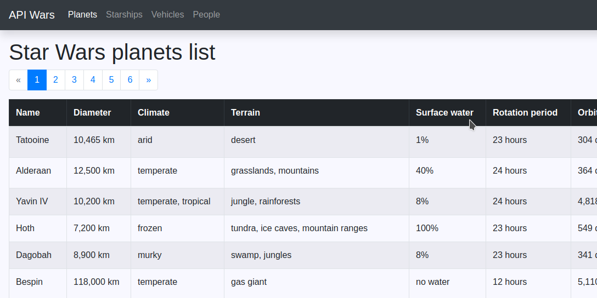

# API Wars

## Description
The application was created to learn programming. It is a small web application that displays data about the Star Wars
Universe (e.g. planets or starships). The data is arranged in a table and properly prepared (e.g. units are given).
The data of the Star Wars is collected from [The Star Wars API](https://swapi.dev/).

Technical information can be found in the [Wiki](https://github.com/piotrmludzik/api-wars/wiki) section.

## Screenshots

## Real-time preview
[https://api-wars-pm.herokuapp.com/](https://api-wars-pm.herokuapp.com/)

## Used technologies:

 

## Challenges:
- [ ] creating a server and a client application from scratch,
- [ ] using AJAX for API requests,
- [ ] using Bootstrap,
- [ ] deploying the application on-line.

## Future plans:
- [ ] implementation of species resources (type of person or character within the Star Wars Universe)
- [ ] creating a simple sql database needed for subsequent features,
- [ ] login system,
- [ ] voting system,
- [ ] voting statistics,
- [ ] loading indicator while the content is loading,
- [ ] improving the color of the website,
- [ ] implementation light / dark mode.

## Contact info
Feel free to contact me in case of any issue, questions or comments.
My contact info can be found on my [GitHub page](https://github.com/piotrmludzik).

## License
Copyright (c) 2020 by Piotr Mludzik. All rights reserved.

Code in this repository is licensed under MIT license. See [LICENSE](https://github.com/piotrmludzik/api-wars/blob/master/LICENSE).